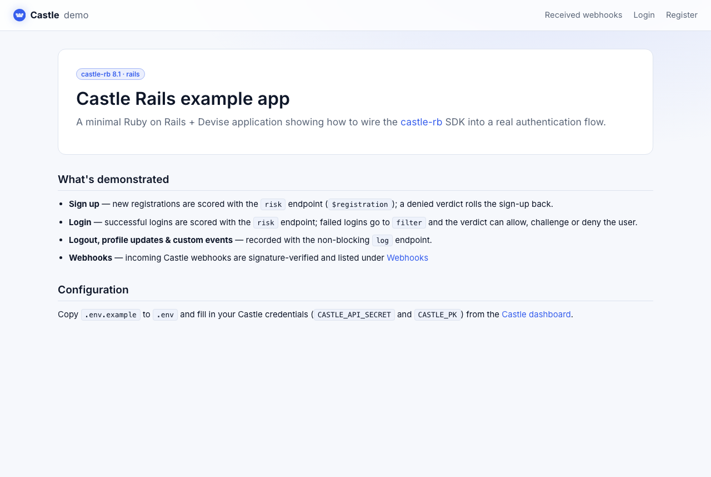
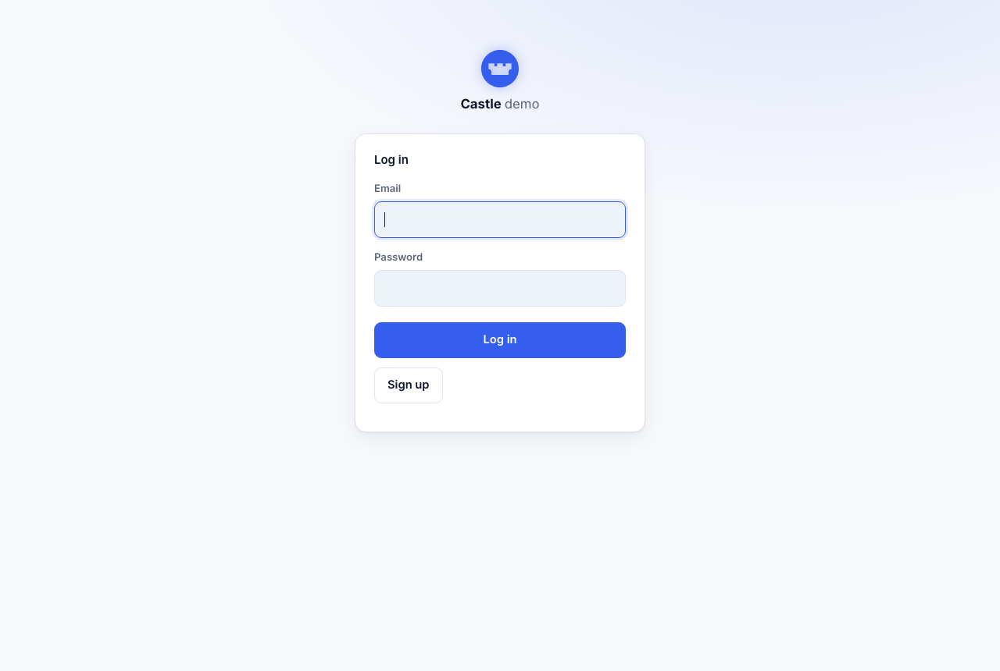

# Castle demo application: Ruby on Rails

This project demonstrates how to integrate [Castle](https://castle.io) into a
real Ruby on Rails application. It is built on Rails 8.1 with Devise for
authentication and uses the [castle-rb](https://github.com/castle/castle-ruby)
SDK (9.x).

## What's demonstrated

- **sign up** – new registrations are scored with the `risk` endpoint
  (`$registration`); a `deny` verdict rolls the sign-up back, mirroring login.
- **login** – successful logins are scored with the `risk` endpoint; failed
  logins are sent to `filter`. The returned verdict (`allow`, `challenge` or
  `deny`) drives whether the session is allowed.
- **logout, profile updates, custom events & password reset** – recorded with
  the non-blocking `log` endpoint. The custom event is available from the
  profile page, and Lists / Privacy / Password reset from the nav, once signed
  in.
- **Lists API** – create a list and fetch all lists with `create_list` /
  `get_all_lists`.
- **Privacy API** – honor GDPR/CCPA access and erasure requests with
  `request_user_data` / `delete_user_data`.
- **webhooks** – incoming Castle webhooks are signature-verified with
  `Castle::Webhooks::Verify` and listed in the app.
- **browser SDK** – the `@castleio/castle-js` SDK mints a request token in the
  browser for every Castle-bound form (sign up, login, profile update, custom
  event, logout) and forwards it to the backend.

## Screenshots

| Home | Login |
| ---- | ----- |
|  |  |

## Prerequisites

You'll need a Castle account. If you don't have one, start a free trial at
https://castle.io. For local development, use a **sandbox** environment so demo
traffic from `localhost` stays separate from production data — from the Castle
dashboard (Settings → API) grab the sandbox keys:

- your **publishable key** (`CASTLE_PK`) – used by the browser SDK
- your **API secret** (`CASTLE_API_SECRET`) – used by the backend SDK

These are the only two values you need to configure.

## Running locally

This app targets **Ruby 3.4** (see `.ruby-version`).

```bash
git clone https://github.com/castle/castle-ruby-example.git
cd castle-ruby-example
bundle install
```

Configure your environment and database:

```bash
cp .env.example .env        # then fill in CASTLE_API_SECRET and CASTLE_PK
cp config/database.yml.example config/database.yml
bin/rails db:prepare
```

Run the app:

```bash
bin/rails server
# => http://127.0.0.1:3000
```

`bin/setup` runs the dependency install, file copying and database setup in one
step.

## Running the tests

```bash
bundle exec rspec
```

## Running with Docker

The bundled `Dockerfile` is a multi-stage build that compiles assets and runs
the app with Puma as an unprivileged user on port 3000. The SQLite database is
created on first boot.

```bash
docker build -t castle-demo-ruby .

docker run -d -p 4006:3000 \
  -e CASTLE_API_SECRET=YOUR_API_SECRET \
  -e CASTLE_PK=YOUR_PUBLISHABLE_KEY \
  castle-demo-ruby
```

The app will be available at http://127.0.0.1:4006. Point it at a Castle sandbox
environment when running locally. A `SECRET_KEY_BASE` is generated automatically
if you don't supply one (set it explicitly to keep sessions across restarts).

## Disclaimer

This sample app is shared in the hope that other developers find it useful.
Although it is not an officially supported sample, we welcome questions and
suggestions at `support@castle.io`.
